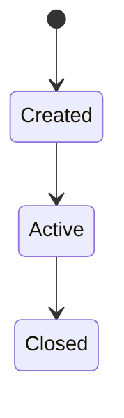

# 핵심 도메인 로직

## 핵심 도메인 개체 (Entity)

| 개체 | 정의 | 핵심 불변조건 |
|---|---|---|
| | | |

## 핵심 비즈니스 규칙

- (규칙 1): 조건 → 결과
- (규칙 2): ...

## 상태 전이 (해당하는 경우)

각 규칙의 시나리오별 적용 예시는 [02-scenario/01-feature-scenarios](../../02-scenario/01-feature-scenarios/README.md)에서 확인한다.
