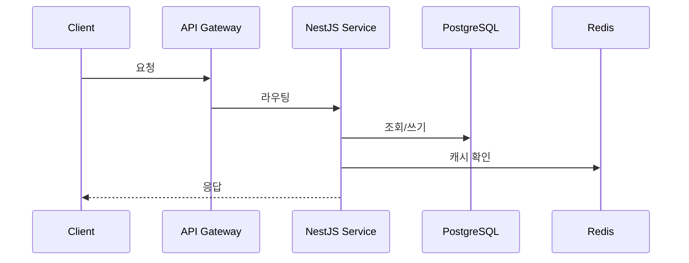

# 데이터 흐름 개요

## 대표 요청 흐름: (예: 사용자 요청 처리)

## 비동기/이벤트 흐름 (해당하는 경우)

- 이벤트 발행자 → 큐(Redis/SQS) → 소비자 → 처리 결과

## 캐시 전략

- 캐시 대상, TTL, 무효화 조건

이 흐름의 세부 코드 위치는 [04-code/01-business-logic](../../04-code/01-business-logic/README.md)를 참조한다.
