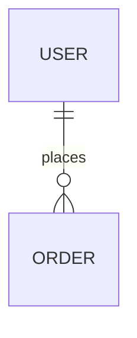

# 용어집 및 도메인 모델

## 용어집

| 용어 | 정의 | 비고/헷갈리는 유사 용어 |
|---|---|---|
| | | |

## 도메인 모델 (핵심 개체 관계)

```mermaid
erDiagram
  USER ||--o{ ORDER : places
```

새 용어를 도입할 때는 이 문서에 먼저 등록하고 코드/문서 전반에 일관되게 사용한다.
