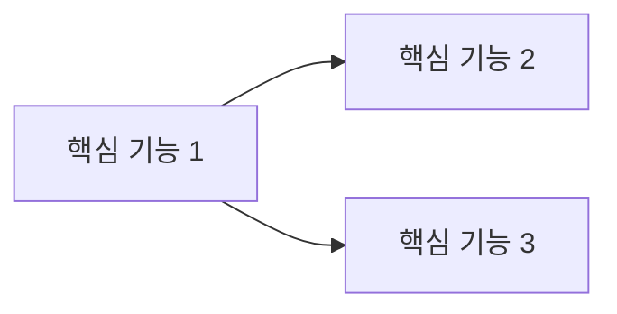

# 서비스 개요

## 한 줄 정의

(서비스 설명)

## 핵심 가치 제안

- 사용자가 이 서비스로 얻는 것:
- 기존 대안 대비 차별점:

## 상위 기능 지도

| 기능 영역 | 한 줄 설명 | 상세 시나리오 |
|---|---|---|
| | | [01-feature-scenarios](../01-feature-scenarios/README.md) 내 파일 링크 |

## 핵심 사용자 페르소나

| 페르소나 | 목표 | 주요 여정 |
|---|---|---|
| | | [02-user-flows](../02-user-flows/README.md) 내 파일 링크 |
