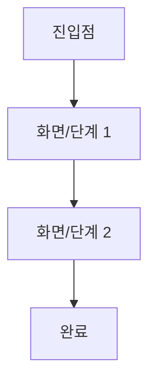

# 사용자 흐름: (흐름명)

- 상태: 목록화됨 / 상세작성됨 / 구현됨 / 변경검토중 ([flow-catalog.md](flow-catalog.md)와 동기화 유지)
- 관련 페르소나: (02-scenario/00-service-overview/service-overview.md 참조)
- 구현 위치 (구현됨일 때만): [04-code/01-business-logic](../../04-code/01-business-logic/README.md) 링크

## 흐름도

화면 배치나 분기가 mermaid로 표현하기 버거울 만큼 복잡하면(예: 여러 역할이 동시에 얽히는 승인 흐름), `diagrams/<이-흐름-슬러그>.excalidraw`(또는 사용 중인 도구)로 별도 그리고 여기에 렌더 이미지를 삽입한다 — 대부분의 흐름은 mermaid만으로 충분하니 예외적으로만 쓴다.

## 단계별 상세

| 단계 | 화면/라우트 | 사용자 행동 | 시스템 반응 | 실패 시 대응 |
|---|---|---|---|---|
| 1 | | | | |

## 관련 기능 시나리오

[01-feature-scenarios](../01-feature-scenarios/README.md) 내 관련 파일 링크
